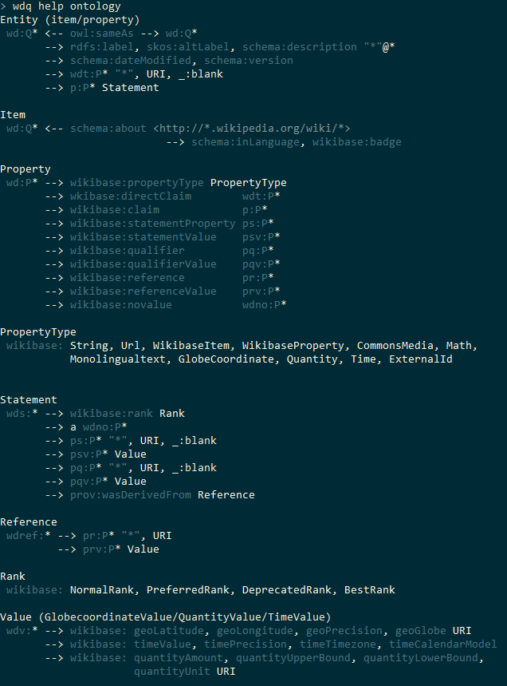
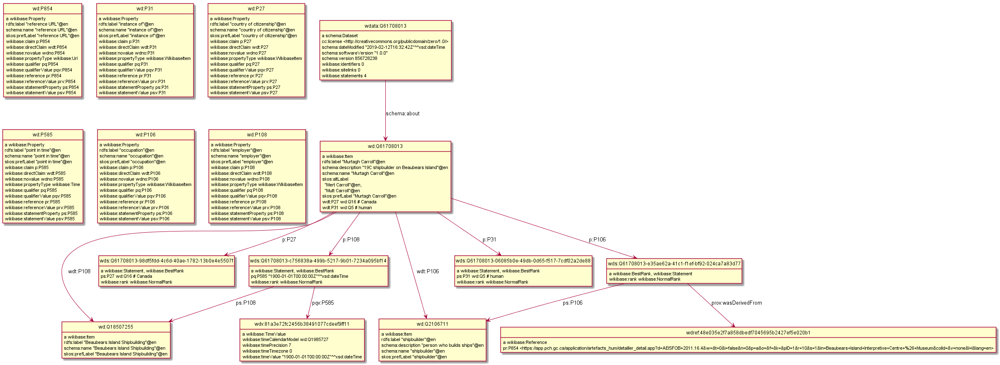
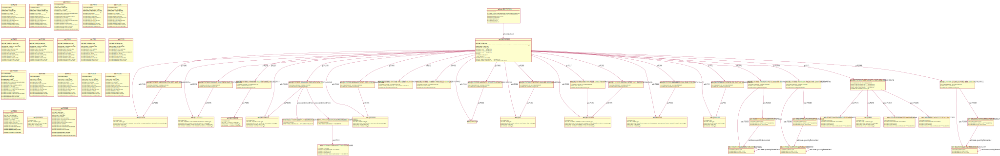

What does Wikidata RDF actually look like?

## Ontology

`wdq help ontology` from https://github.com/nichtich/wdq helps immensely, it is reproduced below:

But even it doesn't describe the whole story, eg `wikibase:directClaimNormalized` etc.

## Scripts

Here are some simple scripts to:
- Download some Wikidata entities and save as Turtle: [wdget.pl](wdget.pl)
- Visualize the RDF graphs using `rdfpuml` from https://github.com/VladimirAlexiev/rdf2rml: `Makefile`
- Save as PNG (in many cases the canvas is cut off on the right!) and SVG (the full diagram is seen)

## Simpler Example: PNG
[person-shipbuilder.png](person-shipbuilder.png):

## Complex Example: SVG
[artefact-chest.svg](artefact-chest.svg):

## TODO
Of course, various improvements are possible, most importantly to print prop label next to the prop URL,
and to skip the property definition boxes as they are static data and not particularly enlightening.

Enjoy!